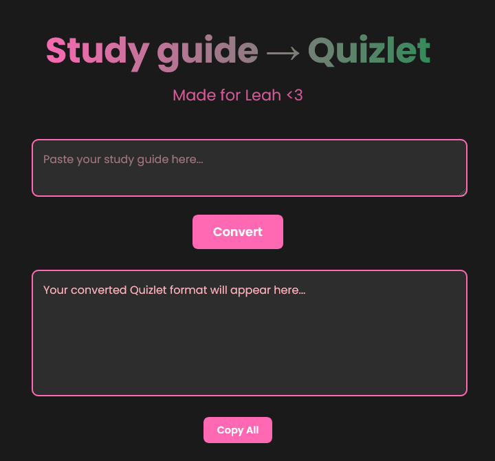

# Quizlet Leah

## Overview

Quizlet Leah is a web application that transforms rough study notes, guides, and information into a Quizlet-friendly format with just a few clicks! Powered by Google's Gemini AI, this tool helps students quickly convert their study materials.

## 🌟 Features

- **Quick Conversion**: Instantly transform unstructured notes into Quizlet-ready format
- **AI-Powered Formatting**: Utilizes Google's Gemini AI for intelligent text transformation
- **One-Click Copy**: Simple, user-friendly interface with easy clipboard functionality
- **Web-Based**: Accessible from any browser without installation

## 🚀 Getting Started

### Access the Tool

Visit the live application at: [https://quizlet-leah.vercel.app/](https://quizlet-leah.vercel.app/)

### How to Use

1. Navigate to the website
2. Paste your study notes or guide
3. Click "Convert"
4. Copy the Quizlet-formatted text with a single click

## 💻 Technologies Used

- HTML
- CSS
- JavaScript
- Google Gemini AI
- Vercel (Hosting)

## 🤝 Contributing

Interested in modifying the project? 

1. Fork the repository
2. Create a feature branch (`git checkout -b feature/YourFeature`)
3. Commit your changes (`git commit -m 'Add some feature'`)
4. Push to the branch (`git push origin feature/YourFeature`)
5. Open a Pull Request

## 📝 License

Distributed under the MIT License. See `LICENSE` for more information.

## 🙏 Acknowledgements

- [Google Gemini](https://ai.google.dev/)
- [Vercel](https://vercel.com/)

## 📬 Contact

GitHub: [Yeti-Owner](https://github.com/Yeti-Owner)

Project Link: [https://github.com/Yeti-Owner/quizlet-leah](https://github.com/Yeti-Owner/quizlet-leah)

**Created with ❤️ for Leah**
